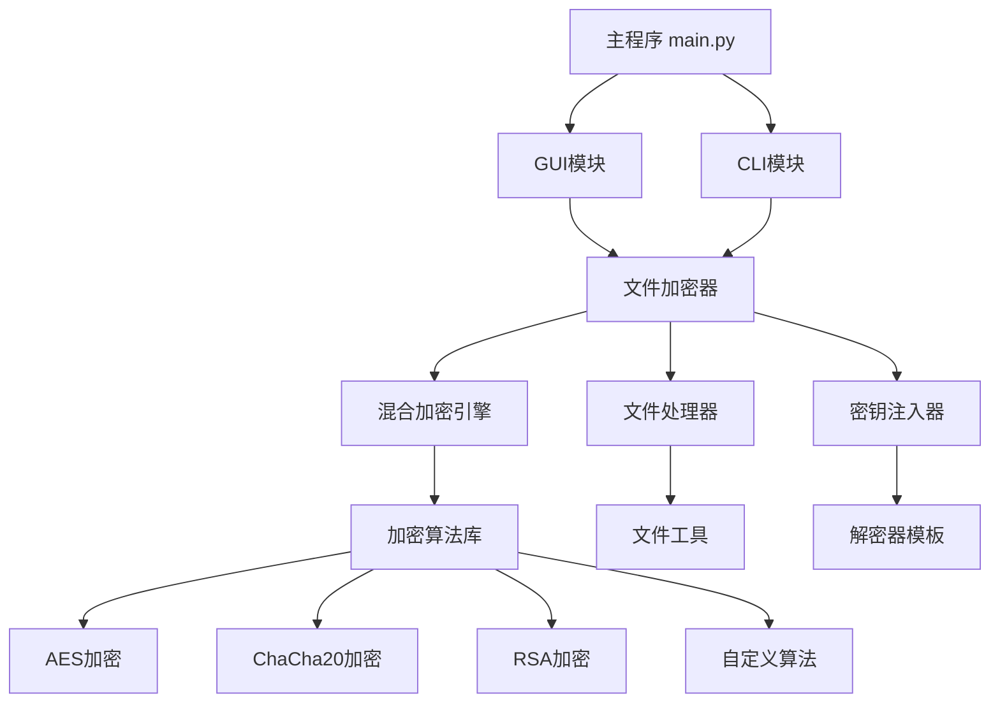

# 开发者指南

本指南面向希望了解、修改或扩展文件加密系统的开发者。

## 📋 目录

1. [项目架构](#项目架构)
2. [核心模块](#核心模块)
3. [扩展开发](#扩展开发)
4. [测试指南](#测试指南)
5. [部署说明](#部署说明)

## 🏗️ 项目架构

### 目录结构

```
jiami/
├── main.py                 # 主入口文件
├── config/                 # 配置文件
│   └── encryption_profiles.json
├── src/                    # 源代码
│   ├── encryptor/         # 加密器模块
│   ├── decryptor/         # 解密器模块
│   ├── crypto/            # 加密算法
│   ├── utils/             # 工具模块
│   └── performance/       # 性能优化
├── gui/                   # 图形界面
├── cli/                   # 命令行界面
├── docs/                  # 文档
└── tests/                 # 测试文件
```

### 架构设计



## 🔧 核心模块

### 1. 文件加密器 (FileEncryptor)

**位置**: `src/encryptor/main.py`

**职责**:
- 协调整个加密流程
- 管理加密配置
- 处理文件和文件夹

**关键方法**:
```python
def encrypt_file(self, file_path: str, output_dir: str, profile: str) -> Dict[str, Any]
def encrypt_folder(self, folder_path: str, output_dir: str, profile: str) -> Dict[str, Any]
def list_profiles(self) -> List[str]
```

### 2. 混合加密引擎 (HybridEngine)

**位置**: `src/encryptor/hybrid_engine.py`

**职责**:
- 实现多层加密逻辑
- 管理加密算法调用
- 处理加密元数据

**关键方法**:
```python
def encrypt(self, data: bytes, profile_config: Dict) -> Tuple[bytes, Dict]
def _encrypt_layered(self, data: bytes, layers: List[Dict]) -> Tuple[bytes, List[Dict]]
def _encrypt_parallel(self, data: bytes, config: Dict) -> Tuple[bytes, Dict]
```

### 3. 加密算法库 (src/crypto/)

每个算法都实现标准接口：

```python
class EncryptionAlgorithm:
    def encrypt(self, data: bytes, **kwargs) -> Tuple[bytes, Dict[str, Any]]
    def decrypt(self, encrypted_data: bytes, metadata: Dict[str, Any]) -> bytes
    def generate_key(self) -> bytes
    def get_recommended_config(self) -> Dict[str, Any]
```

**支持的算法**:
- AES-256 (GCM, CBC, CTR)
- ChaCha20
- RSA (2048, 4096位)
- Salsa20
- Blowfish
- Twofish
- 自定义算法（XOR, 位混洗, 旋转密码等）

### 4. 文件处理器 (FileProcessor)

**位置**: `src/encryptor/file_processor.py`

**职责**:
- 文件读写操作
- 数据序列化
- 文件夹打包

### 5. 密钥注入器 (KeyInjector)

**位置**: `src/encryptor/key_injector.py`

**职责**:
- 生成解密器
- 注入加密元数据
- 添加安全保护

## 🔨 扩展开发

### 添加新的加密算法

1. **创建算法类**

```python
# src/crypto/my_algorithm.py
from typing import Tuple, Dict, Any
from ..utils.logger import Logger

class MyAlgorithm:
    def __init__(self):
        self.logger = Logger("MyAlgorithm")
    
    def encrypt(self, data: bytes, **kwargs) -> Tuple[bytes, Dict[str, Any]]:
        # 实现加密逻辑
        encrypted_data = self._my_encrypt(data)
        metadata = {
            'algorithm': 'MyAlgorithm',
            'key': self._generate_key(),
            # 其他元数据
        }
        return encrypted_data, metadata
    
    def decrypt(self, encrypted_data: bytes, metadata: Dict[str, Any]) -> bytes:
        # 实现解密逻辑
        return self._my_decrypt(encrypted_data, metadata)
```

2. **注册算法**

在 `src/crypto/__init__.py` 中添加：
```python
from .my_algorithm import MyAlgorithm
__all__.append("MyAlgorithm")
```

3. **更新混合引擎**

在 `src/encryptor/hybrid_engine.py` 中添加算法支持：
```python
def _encrypt_my_algorithm(self, data: bytes, config: Dict) -> tuple:
    from ..crypto.my_algorithm import MyAlgorithm
    algorithm = MyAlgorithm()
    return algorithm.encrypt(data, **config)
```

### 添加新的GUI组件

1. **创建组件类**

```python
# gui/my_dialog.py
from PyQt6.QtWidgets import QDialog, QVBoxLayout, QPushButton

class MyDialog(QDialog):
    def __init__(self, parent=None):
        super().__init__(parent)
        self.init_ui()
    
    def init_ui(self):
        layout = QVBoxLayout(self)
        # 添加UI组件
```

2. **集成到主窗口**

在 `gui/main_window.py` 中添加菜单项或按钮。

### 添加新的CLI命令

1. **扩展CLI解析器**

在 `cli/enhanced_cli.py` 中添加新的子命令：

```python
def _add_my_parser(self, subparsers):
    my_parser = subparsers.add_parser('mycommand', help='我的命令')
    my_parser.add_argument('--option', help='选项')
```

2. **实现命令处理**

```python
def _handle_my_command(self, args):
    # 实现命令逻辑
    pass
```

### 性能优化

1. **大文件处理**

使用 `LargeFileProcessor` 处理大文件：

```python
from src.performance.large_file_processor import LargeFileProcessor

processor = LargeFileProcessor(chunk_size=64*1024*1024)
result = processor.process_large_file(
    file_path, output_path, encryption_function
)
```

2. **内存管理**

使用 `MemoryManager` 监控内存：

```python
from src.performance.memory_manager import MemoryManager

with MemoryManager(max_memory_percent=80) as memory_manager:
    # 执行内存密集型操作
    pass
```

3. **进度跟踪**

使用 `ProgressTracker` 显示进度：

```python
from src.performance.progress_tracker import ProgressTracker

def progress_callback(info):
    print(f"进度: {info['progress_percent']:.1f}%")

tracker = ProgressTracker(total_size, progress_callback)
# 在处理过程中调用 tracker.update(processed_bytes)
```

## 🧪 测试指南

### 单元测试

创建测试文件 `tests/test_my_module.py`：

```python
import unittest
from src.crypto.my_algorithm import MyAlgorithm

class TestMyAlgorithm(unittest.TestCase):
    def setUp(self):
        self.algorithm = MyAlgorithm()
    
    def test_encrypt_decrypt(self):
        test_data = b"Hello, World!"
        encrypted, metadata = self.algorithm.encrypt(test_data)
        decrypted = self.algorithm.decrypt(encrypted, metadata)
        self.assertEqual(test_data, decrypted)

if __name__ == '__main__':
    unittest.main()
```

### 集成测试

测试完整的加密流程：

```python
def test_full_encryption_flow():
    from src.encryptor.main import FileEncryptor
    
    encryptor = FileEncryptor()
    result = encryptor.encrypt_file("test.txt", "./output", "standard")
    assert result['success'] == True
```

### 性能测试

使用基准测试模块：

```python
from src.performance.benchmark import Benchmark

benchmark = Benchmark()
results = benchmark.run_encryption_benchmark(
    algorithms=['aes256', 'chacha20'],
    data_sizes=[1024, 1024*1024, 10*1024*1024]
)
```

## 📦 部署说明

### 打包为可执行文件

使用 PyInstaller：

```bash
# 安装 PyInstaller
pip install pyinstaller

# 打包主程序
pyinstaller --onefile --windowed main.py

# 打包CLI工具
pyinstaller --onefile cli/enhanced_cli.py
```

### Docker 部署

创建 `Dockerfile`：

```dockerfile
FROM python:3.9-slim

WORKDIR /app
COPY requirements.txt .
RUN pip install -r requirements.txt

COPY . .
EXPOSE 8000

CMD ["python", "main.py", "--cli"]
```

### 配置管理

1. **环境变量**

```python
import os

DEBUG = os.getenv('DEBUG', 'False').lower() == 'true'
LOG_LEVEL = os.getenv('LOG_LEVEL', 'INFO')
```

2. **配置文件**

支持 JSON 和 YAML 格式的配置文件。

## 🔒 安全考虑

### 密钥管理

- 使用安全的随机数生成器
- 密钥不应存储在代码中
- 实现密钥派生函数

### 代码保护

- 使用代码混淆
- 实现反调试机制
- 添加完整性检查

### 数据保护

- 清理内存中的敏感数据
- 使用安全的临时文件
- 实现安全删除

## 📚 参考资源

- [cryptography 文档](https://cryptography.io/)
- [PyQt6 文档](https://doc.qt.io/qtforpython/)
- [Python 安全编程指南](https://python-security.readthedocs.io/)

---

如有开发相关问题，请查看 [API文档](api_reference.md) 或提交 Issue。
